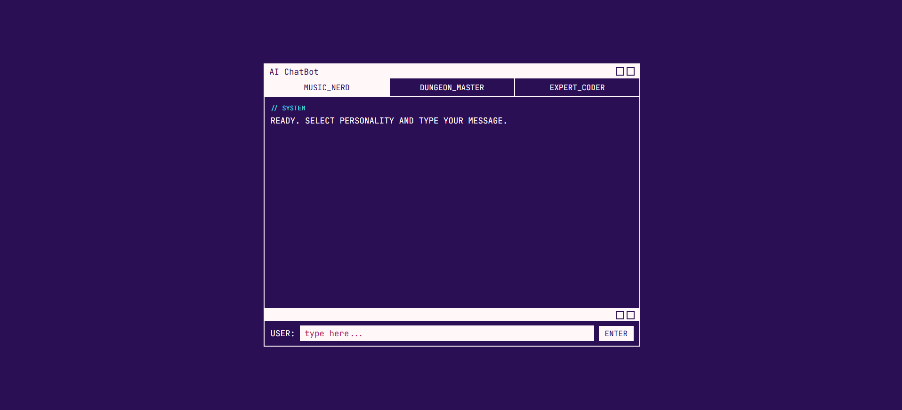

# Spring Boot AI Chatbot

A Spring Boot middleware service for chatting with an LLM through different AI personalities. Built with Java 25 and Spring Boot 4 as part of a school assignment.



## Personalities

- **music-nerd** — knows everything about every genre and artist, has strong opinions
- **dungeon-master** — responds to everything like it's an epic fantasy quest
- **expert-coder** — direct, precise, slightly impatient with vague questions
- **default** — a friendly and helpful assistant

## Getting Started

You'll need Java 25 and Maven installed.

1. Clone the repo and create a `.env` file from the example:

```bash
cp .env.example .env
```

2. Add your OpenRouter API key to `.env` — you can get a free one at [openrouter.ai](https://openrouter.ai/settings/keys):

```properties
AI_API_KEY=your-key-here
AI_MODEL=openrouter/free
```

3. Run it:

```bash
./mvnw spring-boot:run
```

Open `http://localhost:8080` and start chatting.

## API

### POST /api/v1/chat

```json
{
  "personality": "music-nerd",
  "message": "What is a for-loop?",
  "sessionId": "optional-session-id"
}
```

| Field | Type | Required | Description |
|---|---|---|---|
| personality | String | Yes | Determines the system prompt. Options: `music-nerd`, `dungeon-master`, `expert-coder`, `default` |
| message | String | Yes | The user's message |
| sessionId | String | No | Used to maintain conversation history across requests |

The `sessionId` is optional — include it if you want the AI to remember previous messages in the conversation.

## Dev mode

Swagger UI is available at `http://localhost:8080/swagger-ui.html` when running with the `dev` profile active.

## Tech

- Java 25, Spring Boot 4
- Spring RestClient
- Caffeine Cache (conversation memory)
- springdoc-openapi (Swagger)
- WireMock (testing)
